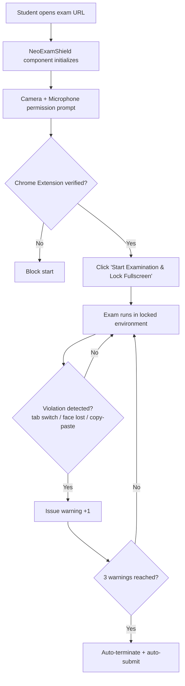

<div align="center">

# 🛡️ NeoExamShield

### Next-Gen AI-Powered Secure Examination Platform


</div>

---

## 📚 Table of Contents

- [Features](#-features)
- [Tech Stack](#-tech-stack)
- [Getting Started](#-getting-started)
- [Environment Variables](#-environment-variables)
- [Available Scripts](#-available-scripts)
- [Proctoring Flow](#-proctoring-flow)
- [Project Structure](#-project-structure)
- [Contributing](#-contributing)
- [License](#-license)

---

## ✨ Features

### Advanced Proctoring System

| Capability | Description |
|---|---|
| **Live Camera & Face Detection** | Continuously monitors test-taker; ensures face stays visible. |
| **Audio & Microphone Monitoring** | Real-time mic level sensing catches ambient noise or talking. |
| **Strict Protocol Enforcement** | Disables right-click, copy, paste, text selection. |
| **Tab & Window Focus Lock** | Detects fullscreen exit or tab switch; triggers auto warning. |
| **Extension Integration** | Requires verified Chrome extension for tamper-proof setup. |
| **Three-Strike Warning System** | Auto-terminates + auto-submits exam after 3 violations. |

### AI-Powered Evaluation
Uses `@google/genai` to analyze responses, surface insights, generate questions dynamically.

### Rich, Interactive UI
- Dashboards via **TailwindCSS** + **Framer Motion**
- Charts via **Recharts**
- Icons via **Lucide React**

### Comprehensive Exam Delivery
- Detailed MCQ rendering
- PDF reports via **jsPDF** + **jsPDF-AutoTable**
- Auto email notifications via **Nodemailer** + **Express**

---

## 🛠️ Tech Stack

<div align="center">


</div>

| Layer | Technologies |
|---|---|
| **Frontend** | React 19, TypeScript, Vite, TailwindCSS 4.1 |
| **Backend/Scripts** | Node.js, Express, TSX, esbuild |
| **AI Integration** | Google Gemini AI API (`@google/genai`) |
| **Styling & Animation** | TailwindCSS, Motion |
| **Utilities** | Lucide React (icons), Recharts (charts), jsPDF (PDF export) |

---

## 🚀 Getting Started

### Prerequisites
- Node.js v18+
- Google Gemini API Key

### Installation

```bash
git clone <your-repository-url>
cd MILESTONE4
npm install
```

### Environment Setup

Create `.env` in root (use `.env.example` as template):

```env
GEMINI_API_KEY=your_api_key_here
```

### Run Dev Server

```bash
npm run dev
```

App runs on default Vite port — usually `http://localhost:5173`.

### Production Build

```bash
npm run build
npm start
```

---

## 🔑 Environment Variables

| Variable | Required | Description |
|---|---|---|
| `GEMINI_API_KEY` | ✅ | API key for Google Gemini AI integration |

---

## 📜 Available Scripts

| Script | Description |
|---|---|
| `npm run dev` | Starts Vite dev server |
| `npm run build` | Builds app for production |
| `npm start` | Starts production server |

---

## 🔒 Proctoring Flow



1. Student navigates to exam URL.
2. `NeoExamShield` component initializes.
3. Student authorizes **Camera** and **Microphone**.
4. System verifies **NeoExamShield Chrome Extension** installed.
5. Student clicks **"Start Examination & Lock Fullscreen"**.
6. Exam runs locked — any deviation issues warning.
7. After **3 warnings** → auto-terminate + auto-submit.

---

## 📁 Project Structure

```
MILESTONE4/
├── src/
│   ├── components/     # React components (NeoExamShield, MCQ renderer, dashboards)
│   ├── hooks/          # Custom hooks (camera, mic, focus-lock)
│   ├── services/       # Gemini AI, PDF, email services
│   └── ...
├── server/              # Express backend
├── .env.example
├── package.json
└── README.md
```

---

## 🤝 Contributing

1. Fork repo
2. Branch: `git checkout -b feature/your-feature`
3. Commit: `git commit -m 'Add feature'`
4. Push: `git push origin feature/your-feature`
5. Open Pull Request

---

## 📄 License

MIT — see `LICENSE` file.

<div align="center">


**Built with 🛡️ for academic integrity**

</div>
